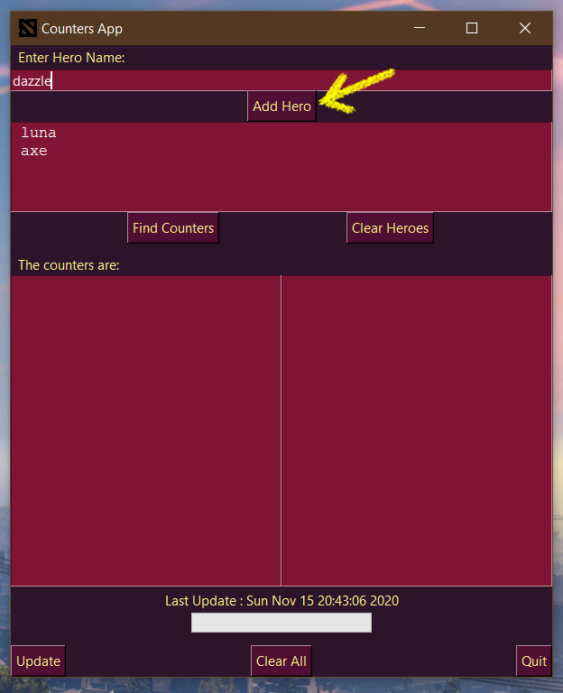
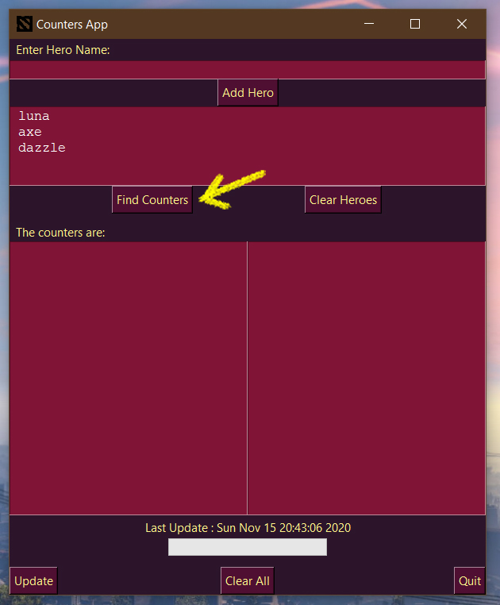
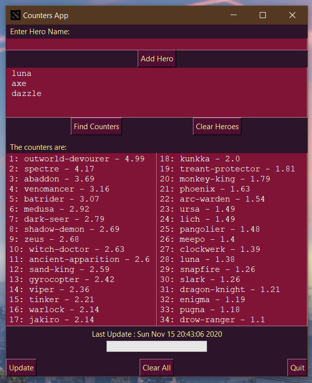
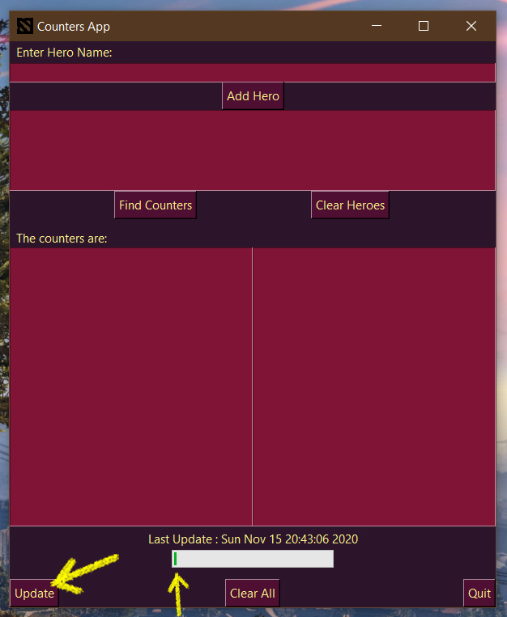

# Counters App

A simple python app which gives counters picks to heroes. Data scraped from [DotaBuff](https://https://www.dotabuff.com/) website using [BeautifulSoup](https://pypi.org/project/beautifulsoup4/) and [requests](https://pypi.org/project/requests/) libraries. I used [Tkinter](https://docs.python.org/3/library/tkinter.html) library for GUI. Thanks to [Flaticon](https://flaticon.com/free-icon/dota-2_871499) for the awesome icon.

---

### Installation

[Python]() should be installed on your machine.
You need to install following libraries:

- [BeautifulSoup](https://pypi.org/project/beautifulsoup4/)
- [Requests](https://pypi.org/project/requests/)
- [Progressbar](https://pypi.org/project/progressbar/)
- [pickle](https://pypi.org/project/pickle5/)

Now you can download the repository or clone it using the following command

`>>> git clone https://github.com/MaanDodiya/counters-app-dota2.git`

Run the python file in terminal

`>>> C:/Python39/python.exe app.py`

---

### Screenshots

Type hero(s) and click **Add Heroes**

 

Click **Find Counters**

 

It will show possible counter picks for the chosen hero(s)

 

Update button will require **active internet connection**. It will fetch updated counters from [DotaBuff](https://https://www.dotabuff.com/) in around 2-3 minutes.

 

---

### About the author

- Name: Maan _"2di.[L]ogan"_ Dodiya
- MMR: 2.5k
- Roles: Offlane, Support
- Region: SEA
- Heroes: Centaur Warrunner, Dazzle, Grimstroke, Dragon Knight, Doom
